# ITSC-206 - Offensive and Defensive Networking Labs
**Brandon Stewart**

---

## Overview

This section covers the labs I completed during ITSC-206: Offensive and Defensive Networking, the second semester follow-up to ITSC-200. Where the first course focused on building and analyzing networks, this course pushed into the security layer - understanding how networks are attacked, how to detect attacks in real time, and how to harden infrastructure against them. Labs cover everything from initial PFSense multi-network deployment and LAN security to IDS configuration, Active Directory hardening, and site-to-site VPN deployment. Each lab builds practical offensive and defensive instincts that sit on top of the networking fundamentals from the previous course.


---

## Lab 1 - PFSense Configuration & Multi-Network Topology

**Topic:** Firewall Configuration | Multi-Network Topology | VirtualBox Adapters | Wireshark Traffic Analysis

### What I Did

Built a multi-network virtualized environment using two PFSense firewalls connecting three isolated networks - Windows 11 on Network A, an interconnect Network B, and a Kali machine on Network C. Configured all VM adapter settings, verified cross-network connectivity with ping, and captured traffic in Wireshark to analyze ICMP, ARP, DNS, HTTP, and TCP protocols.

### Network Topology

| Device | Network(s) | Role |
|---|---|---|
| Windows 11 Pro Education | Network A | End-user client on internal LAN |
| PFSense 1 (PF1) | NAT + Network B + Network C | Gateway providing internet access; connects B and C |
| PFSense 2 (PF2) | Network A + Network B | Gateway between Network A and the interconnect |
| Kali Linux | Network C | Attack/test client on the far-side network |

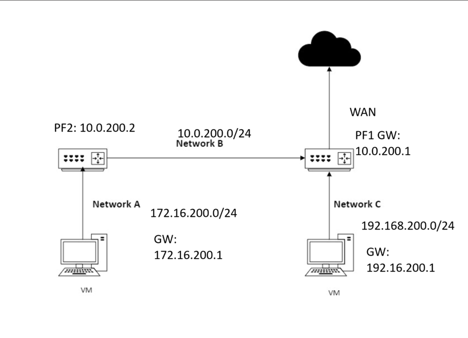

### VM Adapter Configuration

Each machine's network adapters were configured in VirtualBox to place them on the correct virtual networks:

- **Windows Educational:** Internal network adapter assigned to Network A

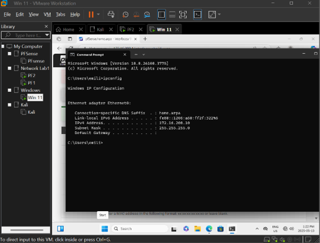

- **PF2:** Two adapters - Internal Network A + Host-Only Network B (interconnect)

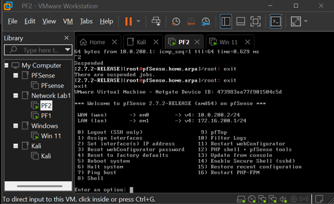

- **PF1:** Three adapters - NAT (internet) + Internal Network B + Internal Network C

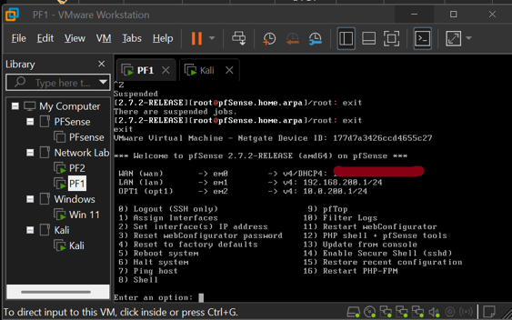

- **Kali:** Internal network adapter assigned to Network C

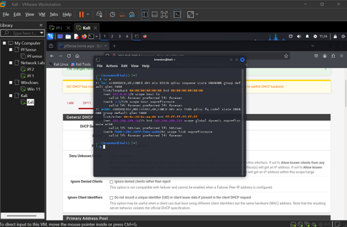


### Connectivity Verification

Confirmed bidirectional routing across all network segments:
- PF1 > PF2 ping: successful

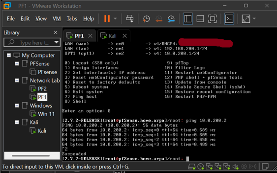

- PF2 > PF1 ping: successful

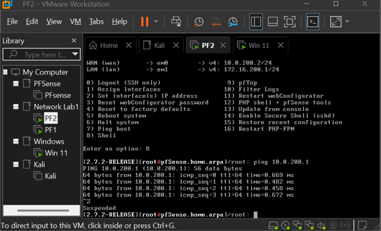

- Windows machine pinging its Network A gateway: successful

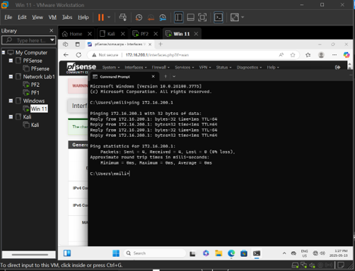

- Kali pinging the gateways of both Network A and Network B: successful

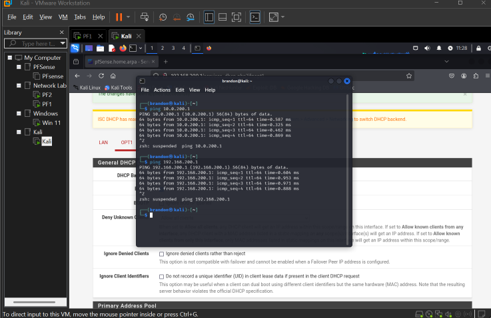


### Wireshark Traffic Analysis

Captured and analyzed traffic across three protocol categories:

**ICMP & ARP (log entries 25-31):**
Ping traffic between machines generated ICMP echo request/reply pairs alongside ARP requests resolving MAC addresses on the local segment. Identified MACs for both the PFSense firewall (`00:0c:29:6c:ea:09`) and the Kali VM (`00:0c:29:b0:9e:4f`), confirming correct Layer 2 resolution alongside the Layer 3 routing.

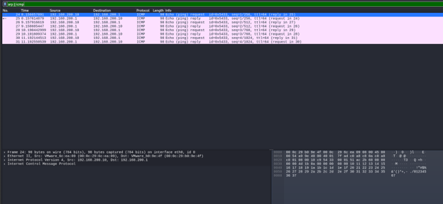

**TCP, DNS & HTTP (log entries 13-23):**
Captured the full request sequence when accessing the PFSense admin web interface. DNS request for `pfsense.local` resolved to `192.168.200.1`, followed by a TCP connection and HTTP traffic to the admin page - demonstrating how name resolution and web traffic interact across the internal network stack.

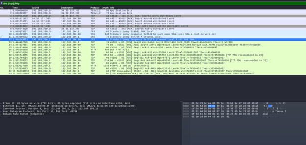

**Filtered HTTP traffic:**
Applied a Wireshark display filter scoped to the Kali machine's IP (`192.168.200.10`) on port 80, isolating its HTTP communication and confirming correct source IP assignment and routing from Network C to the PFSense admin interface.

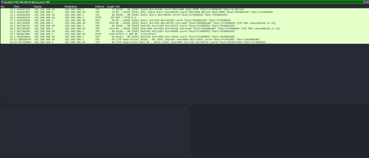


### Skills Demonstrated

- Multi-network PFSense topology design and deployment
- VirtualBox adapter configuration (NAT, Internal, Host-Only)
- Cross-network gateway configuration and routing verification
- Wireshark protocol analysis: ICMP, ARP, DNS, TCP, HTTP
- MAC address identification and Layer 2/3 correlation
- Display filter construction for targeted traffic isolation


---

## Lab 2 - Routing & Firewall Configuration (PFSense Multi-Site)

**Topic:** Static Routing | Multi-Firewall Topology | NAT | Port Forwarding | Firewall Rules

### What I Did

Built on and configured a multi-site network topology using two PFSense firewalls (PF1 and PF2) connected across three networks (Network A: `172.16.200.0/24`, interconnect: `10.0.200.0/24`, Network C: `192.168.200.0/24`) from Lab 1. Configured static routes, gateways, NAT rules, firewall rules, port forwarding, and verified cross-network connectivity using ping, traceroute, SSH, and curl.

### Network Architecture

| Device | Interface | IP | Role |
|---|---|---|---|
| PF1 | WAN | DHCP (`192.168.67.x`) | Upstream internet gateway |
| PF1 | LAN | `172.16.200.1/24` | Network A gateway |
| PF1 | OPT1 | `10.0.200.1/24` | Interconnect to PF2 |
| PF2 | WAN | `10.0.200.2/24` | Connects to PF1 OPT1 |
| PF2 | LAN | `192.168.200.1/24` | Network C gateway |
| Kali (Net A) | eth0 | `172.16.200.16/24` | Attack/test client |
| Windows (Net C) | eth0 | `192.168.200.15/24` | Target/test server |


### Static Routing Configuration

**PF1 static route:** Network `172.16.200.0/24` > Gateway `PF2_GW (10.0.200.2)` via OPT1 - routes traffic destined for Network A through PF2.

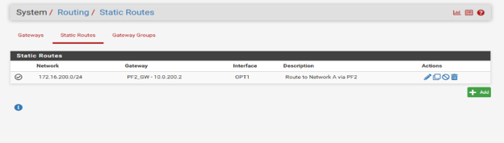

**PF2 static route:** Network `192.168.200.0/24` > Gateway `PF1_GW (10.0.200.1)` via WAN - routes traffic destined for Network C back through PF1.

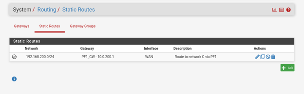

**PF1 Gateway:** Gateway: `10.0.200.1`, Monitor IP: `10.0.200.1` Via WAN

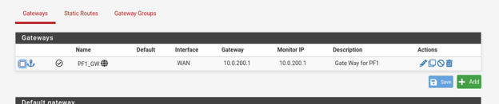

### Connectivity Verification

Verified full bidirectional routing between networks:
- Ping from Kali (Network A `172.16.200.16`) > Windows (Network C `192.168.200.15`): successful, ~2-4ms RTT

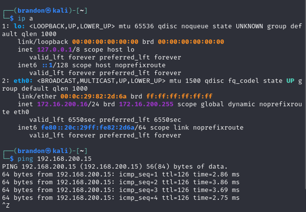

- Ping from Windows (Network C) > Kali (Network A): successful

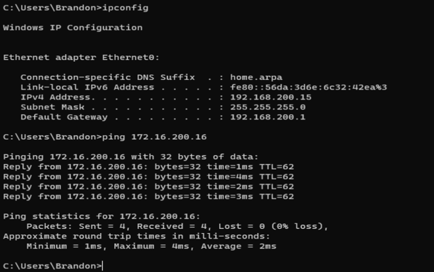

- Traceroute from Network A Kali > Network C (3 hops: PF1 LAN gateway > `10.0.200.1` interconnect > destination)

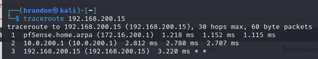

- Traceroute from Network C Windows > Network A (3 hops: PF2 LAN gateway > `10.0.200.2` > destination)

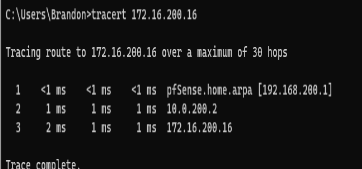


### Services Deployed on Windows (Network C)

- **IIS Web Server** - Installed Internet Information Services; confirmed HTTP access on port 80

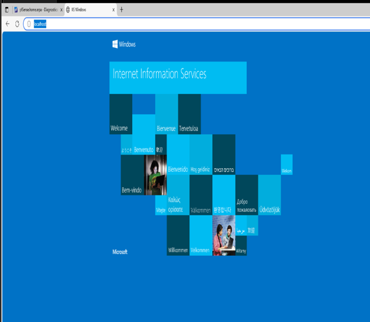

- **OpenSSH** - Installed and started the SSH agent service; confirmed SSH access on port 22

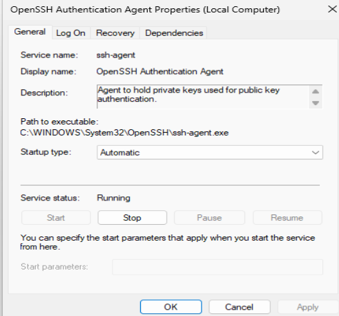

- Windows Defender rules configured to allow SSH and HTTP inbound across all profiles

### Firewall Rules Summary

| Firewall | Interface | Key Rules |
|---|---|---|
| PF1 | LAN | Anti-lockout, allow full outbound from `192.168.200.0/24`, default allow LAN |
| PF1 | OPT1 | Allow from PF2/Kali, HTTP to WinVM (port 80), SSH to WinVM (port 22), allow ICMP |
| PF1 | WAN | Hybrid Outbound NAT with IPsec passthrough; manual mapping for `172.16.200.0/24` |
| PF2 | WAN | Allow upstream traffic, HTTP/SSH/ICMP to Windows VM |
| PF2 | LAN | Anti-lockout, allow LAN anywhere, default allow LAN/IPv6 |

## Firewall Rules

- **PF1 LAN Rules:** This ruleset governs traffic originating from Network C (192.168.200.0/24) on PF1's LAN interface. Beyond the default anti-lockout and LAN-subnet rules, an explicit "Allow full outbound" rule permits Network C clients to reach any destination - this is what lets traffic from PF1's LAN side route out toward PF2 and beyond.

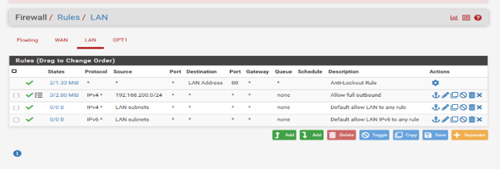

- **PF1 OPT1 Rules:** The OPT1 interface connects PF1 to PF2 across the 10.0.200.0/24 interconnect. These rules selectively open specific services from PF2's side (172.16.200.0/24) to the Windows VM: HTTP on port 80, SSH on port 22, and ICMP for ping testing. The "Allow from PF2/Kali" rule permits the PF2 gateway itself to reach PF1's resources, separate from the per-service rules below it.

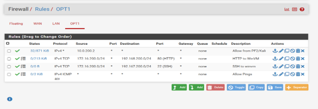

- **PF2 WAN Rules:** On PF2, the WAN interface faces the 10.0.200.0/24 interconnect toward PF1 - effectively mirroring the OPT1 rules on the other side. Traffic from 10.0.200.0/24 is allowed upstream, with matching HTTP and SSH rules to the Windows VM on 192.168.200.0/24, plus an ICMP allow rule so ping can traverse both firewalls in the chain.

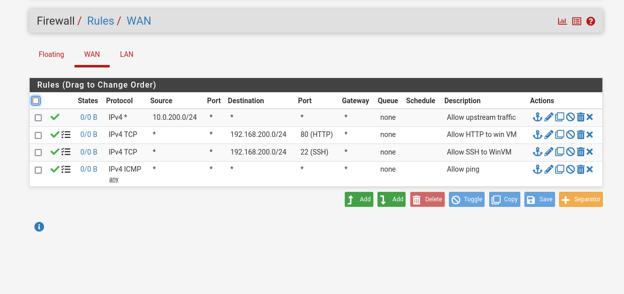

- **PF2 LAN Rules:** PF2's LAN interface serves Network A (172.16.200.0/24). The "Allow LAN anywhere" rule permits any traffic originating from this subnet to pass through, alongside the standard default-allow rules for LAN and IPv6 LAN traffic.

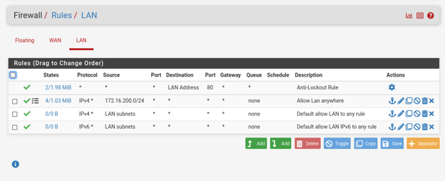


### NAT & Port Forwarding

- **PF1 outbound NAT:** Hybrid mode with IPsec passthrough; `172.16.200.0/24` mapped to WAN address

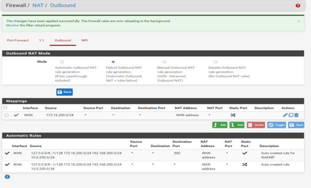

- **PF2 outbound NAT:** `172.16.200.0/24` > WAN address

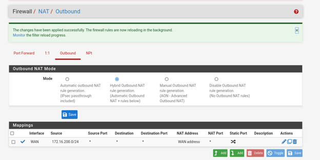


- **Port forwarding (Part III):** WAN TCP port 80 > `192.168.200.15:80` (HTTP to Windows IIS); verified via `curl http://10.0.2.128/example.html` returning `<h1>Lab 2 - Port Forwarding Test</h1>`

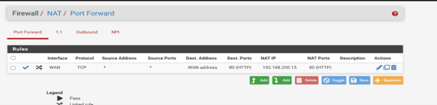

- **Selective blocking:** Added rules to block HTTP (port 80) and HTTPS (port 443) outbound from Network C; confirmed blocks in PFSense firewall logs


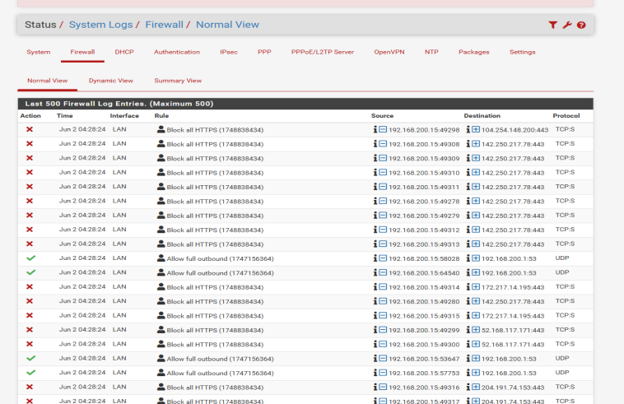

### Cross-Network Access Verification

- Accessed PF1 web GUI from Kali on PF2's Network C via browser (`192.168.200.1`)
- SSH'd from Kali into PF1 console (`ssh admin@192.168.200.1`): received pfSense 2.7.2 shell

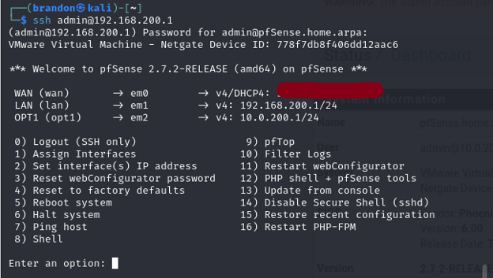

- Nmap scan from Kali > Windows confirmed: `22/tcp filtered`, `80/tcp open`

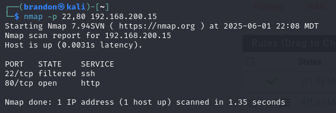

- Private/bogon network blocking disabled on WAN to allow internal RFC1918 routing

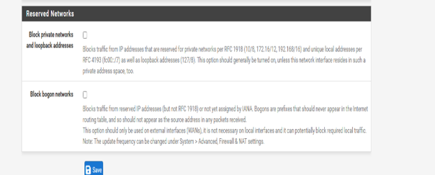


### Port Forwarding - Conceptual Review

**When to use port forwarding:** When external (inbound) access to internal services is required - web servers, FTP, SSH, gaming servers, VoIP, or any application needing a reachable public IP/port combination.

**Risks:**
- Expanded attack surface: exposes internal devices directly to unsolicited internet traffic
- Firewall cannot distinguish malicious from legitimate packets that match the forwarding rule
- Weak authentication, default credentials, or outdated services behind the forwarded port can be compromised
- Overly permissive rules may expose unintended internal services

**Mitigation:** Host-based firewalls, strong authentication, IP whitelisting, and minimal-exposure rule design.

**NAT rule precedence in PFSense:** Port Forward rules take precedence over 1:1 NAT for inbound packets (the reverse applies to outbound). This allows specific port overrides on top of broader NAT behavior.

### Skills Demonstrated

- Multi-firewall static routing configuration
- Gateway and routing table management in PFSense
- NAT (Hybrid Outbound, Port Forwarding, 1:1)
- Windows Server IIS and OpenSSH deployment
- Selective protocol blocking via firewall rules
- Traceroute and routing path analysis
- Port forwarding concepts, risks, and rule precedence


---

## Lab 3 - LAN Security: VLANs, DHCP Snooping, DAI & ARP Poisoning

**Topic:** Network Segmentation | VLAN Configuration | DHCP Spoofing | ARP Poisoning | Ettercap

### What I Did

Designed and deployed a segmented LAN environment in Cisco Packet Tracer using VLANs, OSPF routing, and inter-VLAN routing on routers based on our previous labs. Then deployed and demonstrated a rogue DHCP attack against the network, implemented DHCP snooping and Dynamic ARP Inspection (DAI) to defend against it, and finally executed a live ARP poisoning man-in-the-middle attack using Ettercap against a PFSense-routed network.

### Network Subnetting

Both Network A (`172.16.200.0/24`) and Network C (`192.168.200.0/24`) were each divided into three `/26` subnets:

| Network | Subnet 1 | Subnet 2 | Subnet 3 |
|---|---|---|---|
| Net A `172.16.200.0/24` | `172.16.200.0/26` | `172.16.200.64/26` | `172.16.200.128/26` |
| Net C `192.168.200.0/24` | `192.168.200.0/26` | `192.168.200.64/26` | `192.168.200.128/26` |
| New Mask | `255.255.255.192` | - | - |

### Network Topology

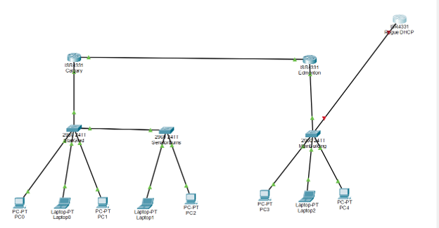


### VLAN & Switch Configuration (Cisco Packet Tracer)

Configured two switches - **Stan Grad** (Network A) and **Senator Burns** (Network C) - each with:
- Named VLAN creation and verification
- VLAN 99 as the management VLAN with IP assignment

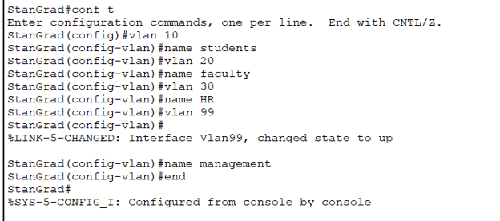

- Access mode port assignments per VLAN

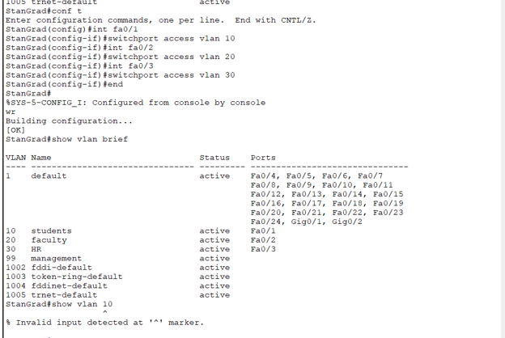

- Trunk port configuration between switches, with trunking confirmed

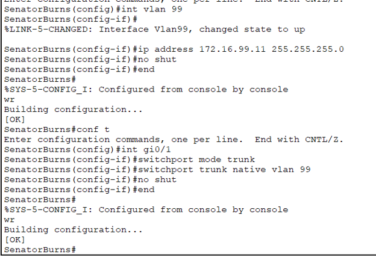

Configured routers **Calgary** and **Edmonton** for inter-VLAN routing:
- Sub-interfaces per VLAN with 802.1Q encapsulation
- IP helper-address on each sub-interface to relay DHCP UDP broadcasts

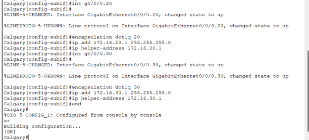

- DHCP pools defined per VLAN with excluded ranges and default gateways

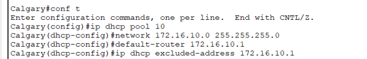

- OSPF enabled on both routers with network advertisements; verified neighbor adjacency and routing

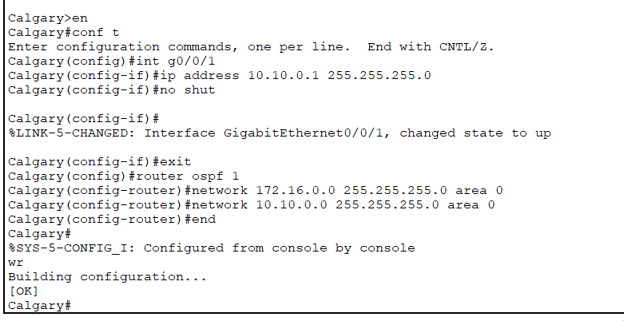

Confirmed full end-to-end connectivity: ping between PCs on different VLANs across Network A and Network C.

### Rogue DHCP Attack Demonstration

Introduced a **Rogue DHCP** router into the topology:
- Connected via trunk port on Main Building switch
- Configured sub-interfaces with fake DHCP pools for VLANs 10, 20, and 30

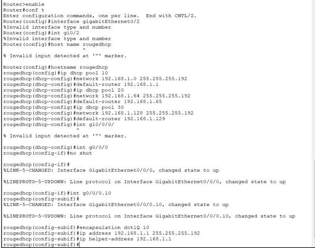

- Confirmed that a connected PC received a rogue IP from the attacker's DHCP server instead of the legitimate one

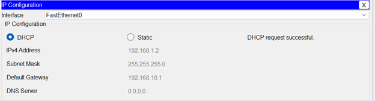


### DHCP Snooping Defense

Enabled DHCP snooping on Main Building switch:
- Enabled globally and per VLAN
- Designated legitimate uplink as trusted port; all other ports untrusted

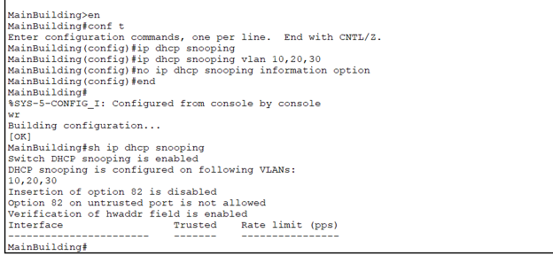

- Set DHCP packet rate limits on untrusted ports

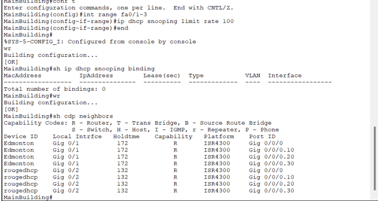

- After configuration: the rogue DHCP server was unable to assign addresses to clients

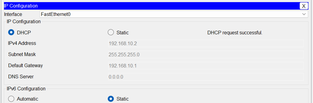


### Dynamic ARP Inspection (DAI)

Configured Dynamic ARP Inspection on Main Building to prevent ARP/MAC spoofing attacks by validating ARP packets against the DHCP snooping binding table:
- Enabled DAI on VLANs 10, 20, and 30
- Configured the trunk port (gi0/2) connecting to the second switch as a trusted interface, so ARP packets traversing it bypass inspection

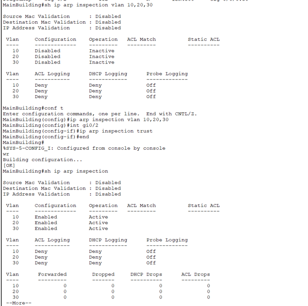

### Port Security and DTP Hardening

Configured Main Building access ports to restrict MAC address learning and disabled trunk negotiation on the uplink to prevent VLAN hopping:

- Disabled DTP negotiation on gi0/2 using switchport nonegotiate
- Set FastEthernet0/1–14 to access mode with port security enabled, a maximum of 2 MAC addresses per port, and violation mode set to "restrict"

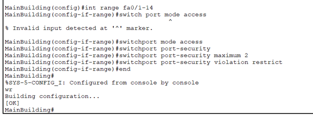


### ARP Poisoning Attack (Ettercap)

Cloned the PFSense lab environment and executed a live man-in-the-middle ARP poisoning attack:

**Attack steps:**
1. Verified baseline ARP tables on Victim VM, Attacker VM, and PFSense gateway - all unique MACs

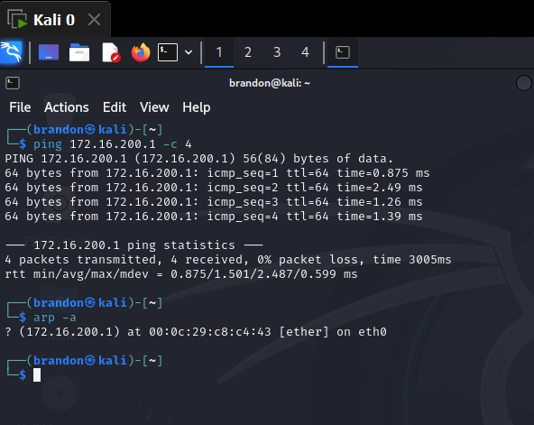

2. Launched Ettercap; set Target 1 as the default gateway and Target 2 as the Victim VM

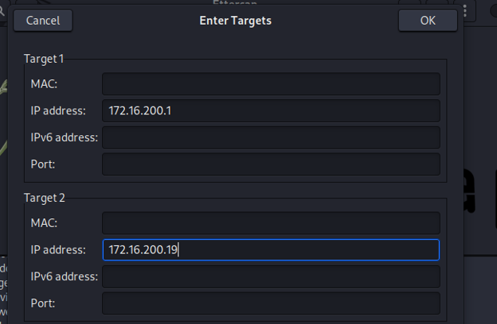

3. Started ARP poisoning with "sniff remote connections" enabled

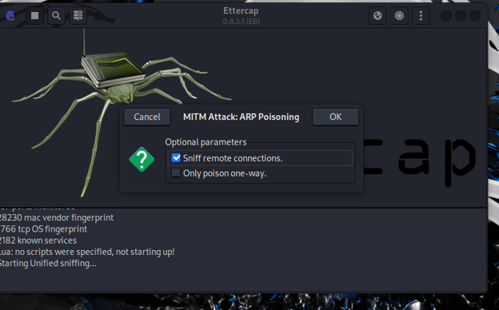

4. Wireshark confirmed the Attacker VM began broadcasting its MAC as the gateway's IP

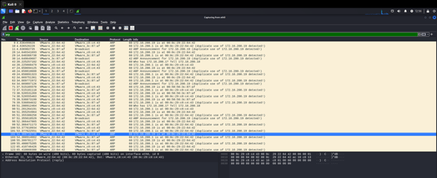

5. `arp -a` on Victim VM showed the gateway's IP now resolving to the Attacker's MAC


6. `arp -a` on PFSense confirmed the Victim's IP appeared on the same MAC as the Attacker


7. Followed TCP stream in Wireshark - captured HTTP traffic from the Victim's browser session passing through the Attacker


8. Stopped attack: all ARP tables returned to their correct MAC/IP mappings


### Skills Demonstrated

- Subnetting and VLSM calculations
- VLAN configuration, trunking, and inter-VLAN routing (router-on-a-stick)
- DHCP pool configuration with helper-address relay
- OSPF routing protocol setup and verification
- Rogue DHCP attack execution and analysis
- DHCP snooping configuration (trusted/untrusted ports, rate limiting)
- Dynamic ARP Inspection (DAI)
- Port security with sticky MAC address learning
- ARP poisoning man-in-the-middle attack using Ettercap
- Wireshark analysis of ARP and TCP stream captures


---

## Lab 4 - Intrusion Detection with Snort (PFSense)

**Topic:** IDS Configuration | Custom Rule Writing | Community Rulesets | Port Knocking Detection

### What I Did

Installed and configured **Snort** as an IDS on PFSense, wrote custom detection rules for ICMP, SSH, DHCP spoofing, and port scan activity, analyzed community rulesets from GPLv2 and Emerging Threats Open, and detected SSH connections and Nmap scans in real time.

### Lab Topology
Attacker VM and Victim VM connected through PFSense, with Snort monitoring both WAN and LAN interfaces (Block Offenders disabled by default until explicitly tested).


### Custom Rules Written

**ICMP Detection (LAN):**
Detected ICMP traffic successfully; used as baseline validation that Snort was operational.


**HTTPS Rule (WAN):**
Created a WAN-side rule targeting HTTPS traffic; triggered by browsing to `sait.ca`.


**DHCP Spoofing Detection:**
```
alert udp any 67 -> any 68 (msg:"Possible DHCP spoofing - Multiple DHCP servers";
threshold:type both, track by_src, count 2, seconds 30; sid:1002; rev:1;)
```
Monitors UDP port 67>68 (DHCP server>client traffic). Triggers when the same source sends 2+ DHCP offers within 30 seconds - characteristic of a rogue DHCP server competing with the legitimate one. Confirmed alert in Snort logs when rogue DHCP was active.


**SSH Connection Attempt (Inbound):**
```
alert tcp any any -> any 22 (msg:"SSH Connection Attempt"; flags:S; sid:1004; rev:1;)
```
Detects TCP SYN packets destined for port 22 - flags any SSH initiation attempt.


**SSH Server Response:**
```
alert tcp any 22 -> any any (msg:"SSH Login - Server Response"; content:"SSH-2.0"; sid:1005; rev:1;)
```
Detects the SSH server's protocol banner (`SSH-2.0`) in the response, confirming an active SSH session was established.


**Port Scan Detection:**
```
alert tcp any any -> any any (msg:"Port Scan Detected - TCP SYN Scan";
flags:S; threshold:type threshold, track by_src, count 10, seconds 5; sid:1008; rev:1;)
```
Triggers when a single source sends 10+ TCP SYN packets within 5 seconds - the signature of an Nmap SYN scan (`nmap -sS -T4`). Successfully triggered against a live Nmap scan.


### Community Ruleset Analysis

**GPLv2 Rule - SID 108 (QAZ Worm Backdoor):**
```
alert tcp $EXTERNAL_NET any -> $HOME_NET 7597
(msg:"MALWARE-BACKDOOR QAZ Worm Client Login access";
flow:to_server,established; content:"quazwsx.hsq"; sid:108; rev:12;)
```
Monitors established TCP connections from external networks to internal port 7597, looking for the QAZ worm's hardcoded payload string `quazwsx.hsq`. Only triggers on established sessions flowing toward the server, reducing false positives.


**Emerging Threats Open Rule - SID 2008446 (DNS Cache Poisoning):**
```
alert udp any 53 -> $DNS_SERVERS any
(msg:"ET DNS Excessive DNS responses with 1 or more RR's (100+ in 10 seconds)";
byte_test:2,>,0,10; threshold:type both, track by_src, count 100, seconds 10;
classtype:bad-unknown; sid:2008446; rev:9;)
```
Detects potential DNS cache poisoning by alerting when 100+ UDP DNS responses (containing at least one resource record, verified by byte_test) arrive from the same source within 10 seconds. Confidence: Medium; Severity: Minor.


### Port Knocking & SSH Detection

Performed a port knock sequence to open the SSH port, then established an SSH connection. Both custom SSH rules fired successfully - the SYN attempt rule caught the connection initiation and the `SSH-2.0` content rule confirmed the successful login response.


### Skills Demonstrated

- Snort IDS installation and interface configuration on PFSense
- Custom Snort rule syntax: action, protocol, direction, options (flags, content, threshold, flow)
- DHCP spoofing detection via threshold-based UDP rules
- SSH session detection (both inbound attempt and server response)
- TCP SYN port scan detection
- GPLv2 and Emerging Threats community ruleset analysis
- Port knocking and real-time IDS alert validation


---

## Lab 5 - Active Directory, Kerberos & LDAP

**Topic:** Active Directory | Kerberos Authentication | LDAP | DNS | Domain Configuration

### What I Did

Deployed a Windows Server with **Active Directory Domain Services (AD DS)** and DNS, joined a Windows client to the domain, captured and analyzed **Kerberos authentication packets** (AS-REQ/AS-REP/TGS-REQ/TGS-REP) and **LDAP bind sequences** in Wireshark, and configured IIS with Kerberos-based Windows Authentication for a web service.

### Active Directory Setup

- Installed AD DS and DNS roles on the Windows Server


- Promoted the server to domain controller and established the domain


- Created user accounts with differentiated privilege levels:
  - **Standard user:** Domain User + local admin; access limited (no workstation-add rights, no working-set expansion)

  

  - **Admin account:** Domain Admin + Enterprise Admin + Schema Admin + Group Policy Creator - full AD control scope

  

- Created Organizational Units: HR, Schools, and Management


- Configured a primary DNS zone and verified via PowerShell (`nslookup` confirmed server resolves at its assigned IP)


- Verified `krbtgt` service account: password-protected, never expires, no interactive login, member of Deny Password Replication group


### Domain Join & Client Configuration

- Updated DNS settings on the Windows client to point to the domain controller
- Joined the client to the domain as a standard user
- Verified DNS resolution via `nslookup` and confirmed domain membership in Wireshark


### Kerberos Authentication Analysis (Wireshark)

Captured the full Kerberos exchange during domain login:

| Packet | Purpose | Key Fields |
|---|---|---|
| **AS-REQ** | Client requests a Ticket Granting Ticket (TGT) | Username, domain, device (NetBIOS), timestamp, supported encryption types (etype), nonce |
| **AS-REP** | KDC issues TGT | Username, domain, encrypted session key + TGT (cipher), cipher suite used |
| **TGS-REQ** | Client requests a service ticket using TGT | Server name (SPN), domain, encrypted authenticator, encryption type |
| **TGS-REP** | KDC issues service ticket | Client name (authenticated user), encrypted service ticket, target server name |

**Authentication flow summary:**
- `AS-REQ > AS-REP`: Client proves identity, receives a TGT


- `TGS-REQ > TGS-REP`: Client presents TGT to request access to a specific service (e.g., file server, web app)


**Key field reference:**

| Field | Meaning |
|---|---|
| CNameString | Authenticated user requesting the ticket |
| Realm | Kerberos authentication domain |
| SNameString: krbtgt | Target service - the TGT issuer |
| Nonce | Client-generated random value to prevent replay attacks |
| Etype | Ordered list of supported encryption algorithms |
| Salt | Randomized value mixed into password hashing to prevent rainbow table attacks |
| Cipher | Encrypted authentication data block |

### LDAP Analysis

Captured LDAP packets during domain authentication:
- **BindRequest:** Client requests authentication with the server
- **BindResponse:** Server replies confirming whether login succeeded


Verified Kerberos ticket cache using `klist`, confirming TGT and service ticket storage on the client.


### krbtgt Account

The `krbtgt` account is the Kerberos Master Key Keeper for the domain:
- Its password hash encrypts and decrypts all TGTs issued in the domain
- Acts as the Ticket Granting Service (TGS) - all service ticket requests flow through it
- Disabled for interactive login; uses an automatically generated, extremely long random password
- Unique per domain; part of the Deny Password Replication group

Compromise of the `krbtgt` account enables a **Golden Ticket** attack - an attacker can forge TGTs for any user, granting unrestricted domain access.

### IIS Kerberos Authentication

- Installed IIS Web Server Tools on the domain controller


- Set a Service Principal Name (SPN) for the web server (`HTTP/servername`)


- Configured Windows Authentication on IIS Manager (Kerberos provider)


- Captured Wireshark traffic confirming Kerberos and LDAP responses during web login


### Skills Demonstrated

- Active Directory installation and domain controller configuration
- Organizational Unit and user account creation with scoped privileges
- DNS zone configuration and `nslookup` verification
- Kerberos AS-REQ/AS-REP/TGS-REQ/TGS-REP packet analysis
- LDAP BindRequest/BindResponse analysis
- `klist` Kerberos ticket cache inspection
- IIS SPN configuration and Windows Authentication setup
- Understanding of the `krbtgt` account and Golden Ticket attack surface


---

## Lab 6 - Active Directory Vulnerability Scanning with Nessus

**Topic:** Vulnerability Scanning | SMB Enumeration | Remote Access | Nessus

### What I Did

Extended the Active Directory lab environment by configuring remote SSH access from a domain-joined Windows client and from a Kali machine, then ran a **Nessus** vulnerability scan against the Windows Server and analyzed the discovered vulnerabilities, focusing on SMB exposure.

### Remote Access Configuration

**SSH on Windows Server:**
- Enabled OpenSSH Server (sshd) service with automatic startup


- Configured inbound firewall rules for SSH (port 22) on both Domain and Private profiles


- Added the standard user account and server account to the OpenSSH Users group


- Confirmed SSH from the domain-joined Windows client to the server


- Confirmed SSH from the Kali machine to the Windows Server: received domain login shell


### Nessus Vulnerability Scan

Configured a basic Nessus scan against the Windows Server and analyzed results:


**Vulnerability 1 - Microsoft Windows NTLMSSP Authentication Request Remote Network Information Disclosure**

Port 445 (SMB) was open and responding to Server Message Block requests. The SMB service was replying to NTLMSSP authentication requests in a way that disclosed the remote system's hostname and domain name to unauthenticated requesters. Rated low risk, but in information-sensitive environments this metadata leakage can assist an attacker in reconnaissance.


**Vulnerability 2 - Microsoft Windows SMB NativeLANManager Remote System Information Disclosure**

A related SMB vulnerability on both ports 139 and 445 that exposed broader system information via the NativeLANManager field in SMB negotiation responses - including OS version indicators. Also rated low risk, but compounds the previous finding by providing additional system fingerprinting data.


**Open Ports Confirmed by Port Scanner:**
Both port 139 (NetBIOS Session Service) and port 445 (SMB) appeared in the scan's open port list, corroborating the vulnerability findings.


### Key Takeaway

SMB ports 139 and 445 are a persistent attack surface on Windows systems. While these specific vulnerabilities were low severity, they are the same ports targeted by exploits like EternalBlue (MS17-010) and are routinely probed in real-world attacks. In any internet-facing or segmented environment, these ports should be blocked at the network perimeter unless SMB is explicitly required.

### Skills Demonstrated

- OpenSSH configuration on Windows Server (service, firewall rules, user groups)
- Cross-platform SSH access (Windows client > Server, Kali > Server)
- Nessus basic scan configuration and execution
- SMB vulnerability analysis (NTLMSSP, NativeLANManager disclosure)
- Open port correlation between scan findings and port scanner output
- Risk assessment of information disclosure vulnerabilities


---

## Lab 7 - Site-to-Site VPN with IPsec (PFSense)

**Topic:** IPsec VPN | Site-to-Site Tunnel | Phase 1 & Phase 2 Configuration | Firewall Rules

### What I Did

Configured a **site-to-site IPsec VPN** between two PFSense firewalls (PF1 and PF2) to securely connect two geographically separated internal networks over an untrusted WAN link, and verified encrypted tunnel connectivity with ping and firewall log analysis.

### Network Topology

| Device | Interface | Address | Network |
|---|---|---|---|
| PF1 | WAN | Static (PF2's DHCP-assigned IP) | Interconnect |
| PF1 | LAN | `192.168.200.x/24` | Network A |
| PF2 | WAN | DHCP | Interconnect |
| PF2 | LAN | `172.16.200.x/24` | Network B |


PF1's WAN was configured with a static IP matching PF2's DHCP-assigned address to establish a stable tunnel endpoint. Existing gateway and static routing configs from previous labs were removed in favor of the VPN tunnel.


### IPsec Tunnel Configuration

**Phase 1 (IKE - Key Exchange):**
- PF1 configured with remote gateway pointing to PF2's WAN IP


- PF2 configured with remote gateway pointing to PF1's WAN IP


**Phase 2 (ESP - Data Encryption):** 

- Matched IKE settings on both sides (encryption algorithm, hash, DH group, lifetime)


-The tunnel established successfully and ping between networks worked

**Tunnel Status:** Confirmed via PFSense `Status / IPsec` - Phase 2 showed active with bytes in/out and connection uptime.


### Firewall & NAT Rules

| Firewall | Change | Purpose |
|---|---|---|
| PF1 | Added IPsec interface rules | Permit traffic through the encrypted tunnel |
| PF2 | Added NAT rules for IPsec | Ensure traffic originating from tunnel is correctly handled |
| PF2 | Allow any-to-any rule on tunnel interface | Permit all traffic between the two sites through the VPN |


Also addressed a firewall log error showing `192.168.x` traffic failing to reach `8.8.8.8` (DNS) - adjusted Phase 2 specificity and rule ordering to resolve the DNS resolution issue through the tunnel.

### Connectivity Verified

Confirmed bidirectional ping between machines on Network A (`192.168.200.x`) and Network B (`172.16.200.x`) through the IPsec tunnel.


### Skills Demonstrated

- IPsec site-to-site VPN configuration on PFSense (Phase 1 and Phase 2)
- IKE key exchange and ESP tunnel parameter matching
- Subnet-specific Phase 2 configuration and troubleshooting
- IPsec-aware firewall rule creation
- NAT configuration for VPN traffic
- Tunnel status verification and firewall log analysis
- DNS resolution troubleshooting through an encrypted tunnel


---

## Final Project - Offensive and Defensive Network: Kerberos Process & Roasting

**Topic:** Kerberos Authentication | Kerberoasting | Active Directory Attack & Defense | Sysmon | Event Log Analysis

### What I Did

Executed a full offensive and defensive cycle targeting Kerberos authentication in a Windows Active Directory environment. Set up a multi-network PFSense lab connecting two internal networks, used a compromised domain account and impacket to locate a Service Principal Name (SPN) and perform a Kerberoasting attack, then switched to the defensive side by deploying Sysmon and analyzing Windows Event Logs to detect and trace the attack back to its source.

### Network Topology

| Device | Network | Role |
|---|---|---|
| Windows Server (AD/DC) | 192.168.200.0/24 | Domain Controller, DNS, Kerberos KDC |
| Windows Client | 192.168.200.0/24 | Domain-joined client (compromised account: bstewart) |
| PFSense 1 (PF1) | 192.168.200.0/24 + 10.0.200.0/24 | Gateway bridging internal networks |
| PFSense 2 (PF2) | 10.0.200.0/24 + 172.16.200.0/24 | Secondary gateway |


### Kerberoasting Attack

**Setup - impacket in a Python virtual environment:**
Getting impacket running on the Windows client required configuring a Python virtual environment first - this was the biggest hurdle of the project as it was my first real encounter with Python in a practical context.


**SPN Enumeration:**
Used the compromised `bstewart` account with impacket to query the domain for registered Service Principal Names and locate the `Genesis` service account as a Kerberoasting target.


**Credential Retrieval:**
Cross-referenced the service account against a leaked password document to confirm the plaintext password for `Genesis`.


### Detection and Monitoring

**Sysmon Deployment:**
Installed Sysmon64 on the Windows Server and confirmed it was logging correctly, then opened Event Viewer to search for Kerberoasting indicators.

**Event ID 4769 - Kerberos Service Ticket Request:**
Located Event ID 4769 logs in Event Viewer showing that `bstewart` requested a Kerberos service ticket for `Genesis`. This is the key indicator of a Kerberoasting attempt - a domain account requesting service tickets for SPNs outside normal usage patterns.


**Source Identification:**
The event log tied the request to source address `10.0.200.2` - the PF2 gateway - giving a network-level starting point for further investigation into which machine on that segment initiated the attack.


### Mitigation Strategies

- **Kerberoasting:** Enforce long, complex passwords on service accounts; limit SPN account privileges to only what is required
- **AS-REP hardening:** Require Kerberos pre-authentication on all accounts; use strong passwords to resist offline cracking
- **Delegation abuse:** Use Protected Users groups where possible; disable unconstrained delegation
- **Golden Ticket:** Restrict domain admin accounts; enforce MFA; rotate the `krbtgt` account password periodically
- **Silver Ticket:** Enforce 25+ character passwords on service accounts with regular rotation
- **Post-exploitation access:** Apply Zero Trust principles with continuous verification and Principle of Least Privilege (POLP) to minimize attack surface
- **User education:** Regular phishing awareness and social engineering training with internal testing

### Skills Demonstrated

- Kerberoasting attack execution using impacket in a Python virtual environment
- SPN enumeration and Kerberos service ticket retrieval via a compromised domain account
- Sysmon64 deployment and configuration for Windows endpoint monitoring
- Event ID 4769 log analysis for Kerberoasting detection in Event Viewer
- Network-level attack source tracing using event log metadata
- Kerberos attack surface analysis: Kerberoasting, AS-REP, delegation abuse, Golden Ticket, Silver Ticket
- Active Directory hardening and identity-based mitigation strategy design
- Multi-network PFSense lab environment integration with Windows Server AD


---

## Summary of Skills Acquired

| Domain | Tools & Technologies |
|---|---|
| **Firewall & VM Networking** | PFSense multi-network topology, VirtualBox adapter configuration (NAT, Internal, Host-Only), cross-network routing |
| **Routing & Firewalling** | PFSense (multi-site), static routing, gateway configuration, NAT (outbound, port forward, 1:1), firewall rule management |
| **LAN Security** | VLAN configuration, 802.1Q trunking, inter-VLAN routing, OSPF, DHCP snooping, Dynamic ARP Inspection, port security (sticky MAC) |
| **Attack Techniques** | ARP poisoning (Ettercap), rogue DHCP, man-in-the-middle interception, Kerberoasting (impacket, SPN enumeration, offline cracking) |
| **Intrusion Detection** | Snort IDS (custom rules, community rulesets), GPLv2 and Emerging Threats Open analysis, threshold-based alerting, Sysmon64, Event ID 4769 analysis |
| **Windows Infrastructure** | Active Directory DS, DNS, Kerberos, LDAP, IIS, OpenSSH on Windows, SPN configuration |
| **Vulnerability Assessment** | Nessus scanning, SMB vulnerability analysis (NTLMSSP, NativeLANManager), port correlation |
| **VPN & Encryption** | IPsec site-to-site VPN, IKE Phase 1/Phase 2, ESP tunnel configuration, Wireshark encrypted traffic analysis |
| **Traffic Analysis** | Wireshark (Kerberos, LDAP, ARP, TCP streams), routing table inspection, firewall log analysis, Windows Event Log analysis |
| **CLI & Scripting** | Linux CLI, Python (virtual environments, impacket), `nmap`, `ssh`, `arp`, `traceroute`, `ip route`, `klist`, `nslookup`, `curl`, PowerShell |


---

## Critical Reflection

ITSC-206 pushed me past configuration and into adversarial thinking — not just building networks, but understanding how they fail and how attackers exploit that. The shift from ITSC-200 was noticeable early: Lab 1 felt familiar (topology, adapters, Wireshark), but by Lab 3 I was staging ARP poisoning attacks and watching credentials get intercepted on networks I had built myself. That experience made the theory real in a way that reading about man-in-the-middle attacks never could.

The labs that challenged me most were the ones where tools didn't cooperate out of the box. Getting impacket running inside a Python virtual environment during the final project was genuinely frustrating — it was my first real encounter with Python in a practical context, and the dependency setup alone took significant troubleshooting. In hindsight, that friction was valuable: real-world tools rarely install cleanly, and working through it built confidence I'll carry forward.

The final project was the most meaningful exercise in the course. Executing a Kerberoasting attack with a compromised account, then pivoting to the defensive side — deploying Sysmon, hunting Event ID 4769 in Event Viewer, and tracing the source IP back through the network — gave me a complete picture of how an attack actually looks from both ends of the wire. It reinforced something the course kept returning to: detection is only possible if you understand the attack. You can't write a Snort rule or know which Event IDs matter if you don't know what you're looking for and why.

If I were to approach this course again, I'd invest more time earlier in understanding the why behind firewall rule ordering and NAT traversal. Several labs had moments where traffic silently failed because a rule was in the wrong position or NAT wasn't handling VPN traffic correctly — and diagnosing those issues required building mental models I didn't fully have yet. That's the kind of knowledge that compounds: once it clicks, every subsequent lab gets faster.

Overall, ITSC-206 gave me a practical foundation in both offensive techniques and the defensive tooling used to detect them — a combination I think is essential for anyone working in network security.


---

*Portfolio compiled by Brandon Stewart - ITSC-206 Offensive and Defensive Networking*
